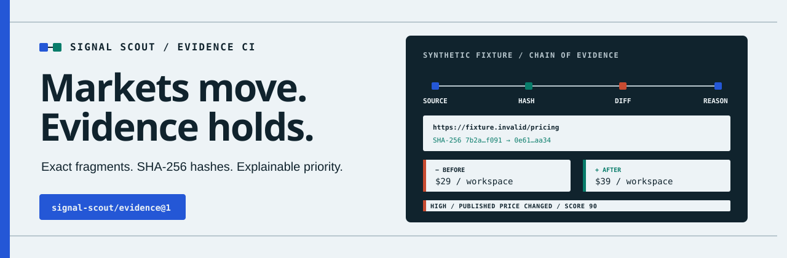

# Signal Scout

Signal Scout turns changes on public competitor pages into versioned JSON and
Markdown evidence: source URLs, capture times, SHA-256 hashes, exact changed
fragments, and deterministic priority reasons.



It is a Git-native, local-first evidence pipeline. The quick start below runs
the checked-out repository; it does not assume a published npm package or a
hosted Signal Scout service.

## Quick start

Requirements: Node.js 24 or newer and pnpm 11 or newer.

```bash
git clone https://github.com/derprofi1313/signal-scout.git
cd signal-scout
corepack enable
pnpm install --frozen-lockfile
pnpm cli init
```

Replace the example URL in `signal-scout.config.json`, then run:

```bash
pnpm cli scan
```

`init` creates `signal-scout.config.json` without overwriting an existing
configuration. The first successful capture establishes a `baseline`; there is
no earlier document to compare. Later captures return `changed` when normalized
semantic lines differ and `no_change` when they do not.

Local state is written below the configured `storageDir`, which defaults to
`.signal-scout` relative to the configuration file. Baseline snapshots are kept
separately from the machine-readable JSON and reviewable Markdown reports under
`.signal-scout/reports`.

```text
.signal-scout/
├── baselines/
│   └── <source-id>.json
└── reports/
    ├── <source-id>.json
    └── <source-id>.md
```

Each successful scan atomically replaces the current files for that source.
Review or copy reports elsewhere before the next scan if you need run-by-run
retention.

## Configure sources

Signal Scout accepts 1–50 public HTTP(S) sources. Use
[`examples/signal-scout.config.json`](examples/signal-scout.config.json) as a
reference, or edit the file produced by `init`:

```json
{
  "$schema": "./signal-scout.schema.json",
  "version": 1,
  "storageDir": ".signal-scout",
  "sources": [
    {
      "id": "example-pricing",
      "name": "Replace with your pricing page",
      "url": "https://example.com/pricing",
      "kind": "pricing",
      "ignoreSelectors": [".cookie-banner", "[data-volatile]"]
    }
  ]
}
```

Replace `https://example.com/pricing`; it is documentation-only. Source IDs use
lowercase letters, numbers, and hyphens. Each source may declare up to 20 CSS
selectors for known volatile content. Allowed kinds are `pricing`, `changelog`,
`product`, `positioning`, `policy`, and `general`. The runtime schema is
[`signal-scout.schema.json`](signal-scout.schema.json).

Signal Scout is for public pages, not authenticated scraping or bypassing
access controls. Before every production connection, including redirects, it
resolves the target, rejects non-public and reserved IPv4/IPv6 addresses, and
pins a validated address to the socket while retaining the hostname for HTTP
and TLS. Redirects are revalidated hop by hop and stop after five hops.

## CLI

During repository development, invoke the checked-out TypeScript CLI through
the package script:

```text
pnpm cli --help
pnpm cli --version
pnpm cli init [--dir <directory>]
pnpm cli scan [--config <path>]
pnpm cli report <packet.json> [--format markdown|json]
```

Without options, `init` writes `signal-scout.config.json` in the current
directory and `scan` reads that file. `init` never overwrites an existing
configuration. A relative `storageDir` is resolved from the directory containing
the selected configuration, not from an unrelated shell directory.

`scan` writes the per-source files shown above and emits the complete `ScanRun`
as JSON on stdout. `report` reads a stored packet and emits Markdown by default;
pass `--format json` for formatted JSON.

Human-readable diagnostics go to stderr. JSON or Markdown intended for another
tool goes to stdout.

| Exit code | Meaning                                                                                           |
| --------: | ------------------------------------------------------------------------------------------------- |
|       `0` | Help/version, initialization, reporting, or a fully successful scan, whether changed or unchanged |
|       `1` | At least one source or another runtime operation failed; successful-source evidence is preserved  |
|       `2` | Missing or invalid config, arguments, packet input, or refusal to overwrite an existing config    |

## What an evidence packet contains

Every packet uses the schema identifier `signal-scout/evidence@1` and records:

- source identity, requested URL, canonical URL, and UTC capture metadata;
- previous and current raw-byte and normalized-text SHA-256 hashes;
- `baseline`, `no_change`, `changed`, or `failed` status;
- ordered before/after semantic fragments with deterministic positions;
- deterministic category, score, `low`/`medium`/`high` priority, and literal
  reasons; and
- disclosed fetch, parse, truncation, or comparison limitations.

The Markdown report is a review surface for the same evidence contract. It is
deterministic evidence, not strategic advice and not a claim that a page change
caused a business outcome.

## Transparent demo

Run the website locally:

```bash
pnpm dev
```

Open [http://localhost:3000](http://localhost:3000) for the product explanation
and `/demo` for an inspectable packet. Demo content is labelled
**Synthetic fixture** and uses `https://fixture.invalid/pricing`; it is not a
live scan, customer result, or usage claim.

## Trust guarantees

For identical captured input and configuration, normalization, diffing,
classification, packet ordering, and hashing are deterministic. Reports retain
the exact normalized fragments used for classification, and limitations travel
with the packet.

SHA-256 hashes make later modification detectable when a trusted hash is
available for comparison. They do not prove who published a page, that the
capture saw every dynamic element, or that a remote server returned the same
content to every observer. Read the complete
[trust model](docs/trust-model.md) before using reports for a consequential
decision.

## Known limitations

- Capture supports public HTML, XHTML, and plain text over HTTP(S); it does not
  execute client-side JavaScript.
- A request times out after 15 seconds and accepts at most 2 MiB.
- Raw hashes cover the exact response bytes. Text is decoded as UTF-8; invalid
  UTF-8 is replaced and disclosed in the packet before normalization.
- Semantic extraction is capped at 800 lines. Diff comparison is bounded to
  400 × 400 lines; any truncation or comparison limit is disclosed.
- Ignore selectors can reduce noise and can also hide a real change if they are
  too broad.
- Deterministic rules explain a priority; they do not express statistical
  confidence, intent, impact, or causality.
- Local capture time depends on the operator's system clock. Signal Scout does
  not notarize packets or sign them with an external authority.

See [Architecture](docs/architecture.md) for module and data-flow details.

## GitHub Actions example

[`examples/github-actions/scan.yml`](examples/github-actions/scan.yml) shows a
scheduled workflow that installs Node 24 and pnpm 11, invokes the checked-out
CLI, preserves baseline state in an Actions cache, and uploads reports as an
artifact. It never commits changes or opens a pull request.

## Local quality gates

```bash
pnpm format:check
pnpm lint
pnpm typecheck
pnpm test
pnpm build
pnpm check
pnpm exec playwright install chromium
pnpm test:e2e
```

`pnpm check` runs formatting, linting, type checking, coverage tests, and the
production build. Browser installation and `pnpm test:e2e` remain explicit.

## Security

Use Signal Scout only for public sources you are permitted to access. Do not
place secrets in configuration or reports. Report vulnerabilities through
[GitHub private vulnerability reporting](https://github.com/derprofi1313/signal-scout/security/advisories/new);
do not disclose exploitable details in a public issue. The full policy is in
[`SECURITY.md`](SECURITY.md).

## Roadmap hypotheses

Potential follow-on work includes managed JavaScript-capable capture, encrypted
retention, team review queues, delivery integrations, and optional
evidence-grounded synthesis. These are hypotheses, not available hosted
features. The deterministic packet remains the source of truth.

## Contributing

Read [`CONTRIBUTING.md`](CONTRIBUTING.md), the
[`CODE_OF_CONDUCT.md`](CODE_OF_CONDUCT.md), and the
[architecture notes](docs/architecture.md) before opening a pull request. For
release history, see [`CHANGELOG.md`](CHANGELOG.md).

## License

[MIT](LICENSE) © 2026 Jannik Agethen.
